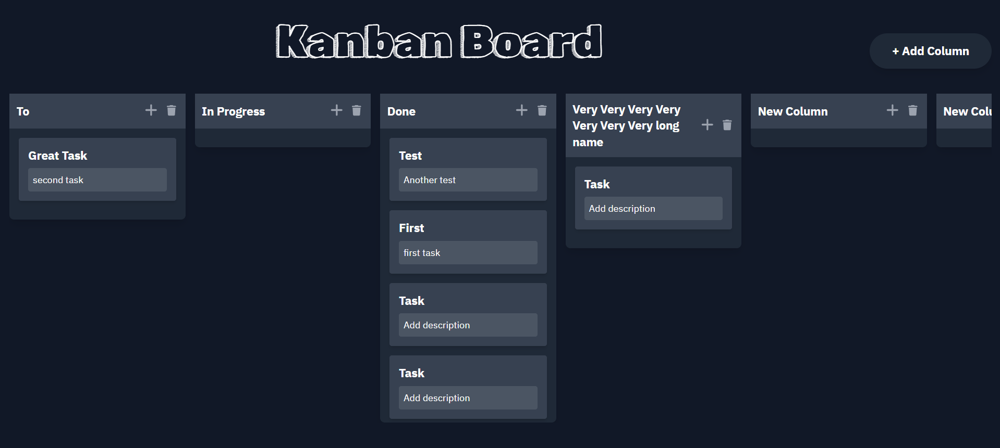

# Kanban Board

This is a simple Kanban Board application built with React and TypeScript. It allows you to create, update, and manage tasks in different columns.



## Features

- Add, update, and remove columns
- Add, update, and remove tasks within columns
- Drag and drop tasks between columns
- Persist data using local storage

## Technologies Used

- React
- TypeScript
- Tailwind CSS
- @hello-pangea/dnd for drag-and-drop functionality
- FontAwesome for icons

## Getting Started

### Prerequisites

- Node.js (v14 or higher)
- npm

### Installation

1. Clone the repository:

```sh
git clone https://github.com/your-username/kanban-board.git
cd kanban-board
```

2. Install Dependencies

```sh
npm install
# or
yarn install
```

3. Running the Application

```sh
npm run dev
# or
yarn dev
```

### Building for Production

```sh
npm run build
# or
yarn build
```
